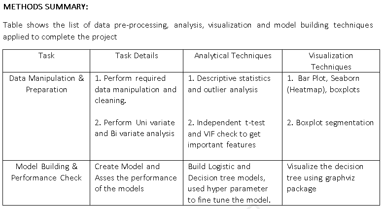
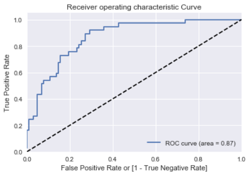

# CreditRiskAnalytics
**Business Context:** Credit  scoring  is  the  set  of  decision  models  and  their  underlying  techniques that  aid  lenders  in  the  granting  of  consumer  credit. Typical application areas in the consumer market include: creditcards, autoloans, home loans and a wide variety of personal loan products.

## Objective
- In this case study, One of the leading banks would like to predict customers who are most likely to default on the loan. 
- For new customers we need to decide whether to extend credit or not by analyzing the behaviour of existing customers.

## Project Summary
- Brief Summary about the techniques used in the project. For full report check out the [CreditRiskAnalytics Summary](CreditRiskAnalytics_Summary.pdf)


- ROC Curve - An ROC curve (receiver operating characteristic curve) is a graph showing the performance of a classification model at all classification thresholds.
- Finding the best cufoff point - which maximises the specificity and the sensitivity. This threshold point might not give the highest   prediction in your model, but it wouldn't be biased towards positives or negatives.



## Installation
The Installation process will get you a copy of the project up and running on your local machine for development and testing purposes
1. Clone or download the project into your local machine.
2. Unzip the project folder.
3. Open the source file [CreditRiskAnalytics-DefaultModel](CreditRiskAnalytics-DefaultModel.ipynb) using [JypyterNotebook](http://jupyter.org/) and execute the file.
4. Instead of step 3, use the classification model loaded in the pickle to classify default customers.

```python
import pickle
# load the model from disk - use to classify the default customers directly
loaded_model = pickle.load(open('OutPutModel/final_model.pkl', 'rb'))
print("Loaded Decision tree model :: ", loaded_model)
```
5. After successfully loading the saved model, we can use them in the general way to predict for test dataset or in the production servers.

### Prerequisites
The following list summarizes the packages/softwares used in this project. These are the softwares/packages you neeed to install before executing the project file.
* Anaconda v – 5.2.0 (py 36_3) 
* Python v – 3.6.5 
* Packages (Packages that are not part of anaconda distribution, need to install using pip installer) 
  * [export_graphviz](https://pypi.org/project/graphviz/)  (pip install graphviz)
  * pydot graphviz  (pip install pydot graphviz) 
  * [pydotplus](https://pypi.org/project/pydotplus/) (pip install pydotplus)

### Repository Contains
 - Data Folder -- Contains Raw Data Files
 - Problem Statement -- Case Study Business Problem Statement
 - [CreditRiskAnalytics Summary](CreditRiskAnalytics_Summary.pdf) -- Credit Risk Analytics Project Summary Report
 - [CreditRiskAnalytics-DefaultModel](CreditRiskAnalytics-DefaultModel.ipynb) -- Project Source Code File
 - [LogisticRegression-KSChart](LogisticRegression-KSChart.xlsx) -- Excel Template File for Lift and Gain Charts
 
### License & CopyRight
Copyright (c) 2018 [Niranjan Kumar](https://www.linkedin.com/in/niranjankumar-c/) Licensed under the [Apache License 2.0](LICENSE)

### Trademarks
All other trademarks referenced herein are the property of their respective owners.
